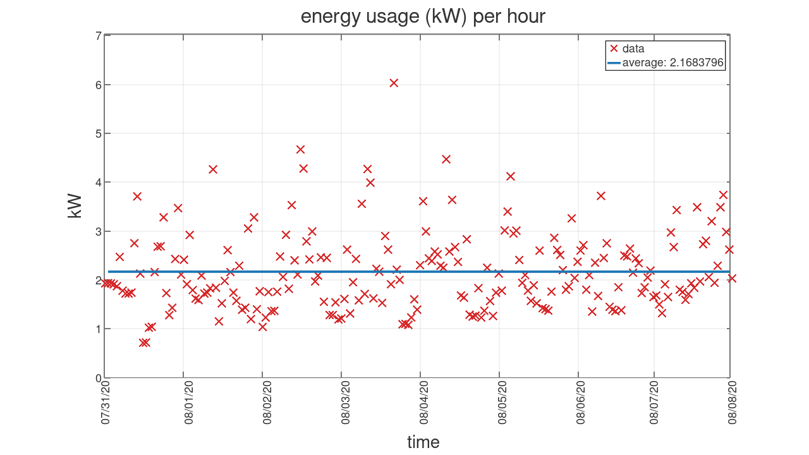

# duke_energy
automate login and get hourly energy usage from duke energy

usage:
 * edit `get_usage.sh` and change your email
 * run `echo "your_duke_energy_password" | openssl enc -aes-256-cbc -a -salt -iter 1 -in - -out -` and save the output to the variable pass_enc in `get_usage.sh`
 * set where you want to save your login in `get_usage.sh`
 * set the meter number from [the duke energy usage analysis page](https://www.duke-energy.com/my-account/usage-analysis) in `get_usage.sh`
 * run `./get_usage.sh | tee usage.csv`
 * run `octave graph_data.m` to generate pretty graph `usage.png`

